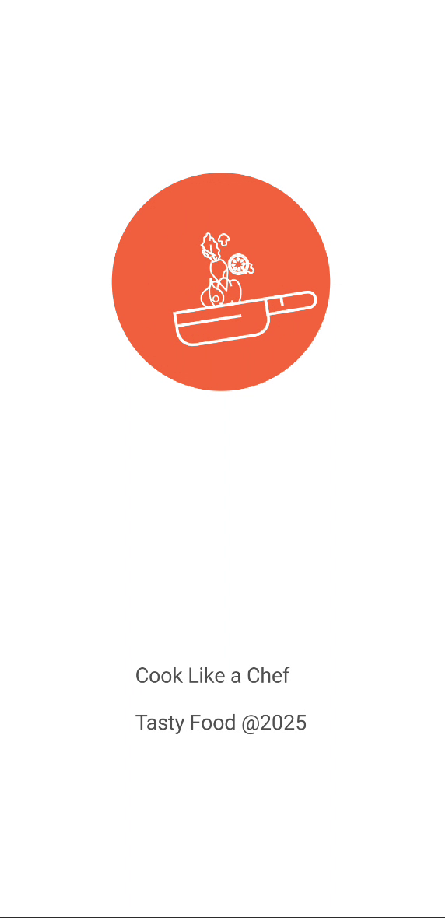
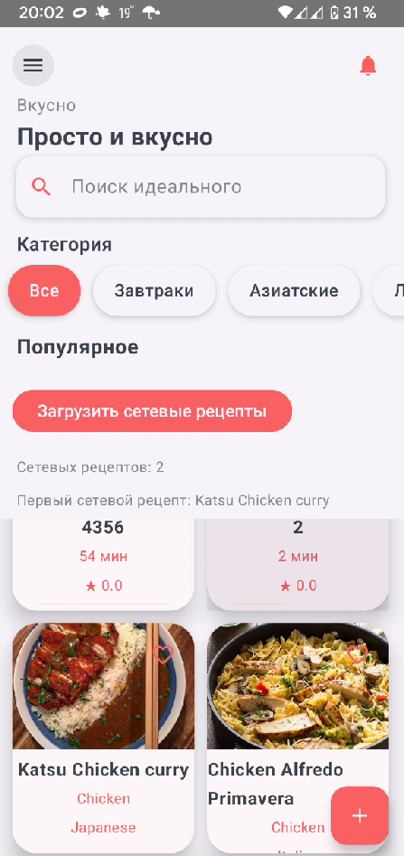
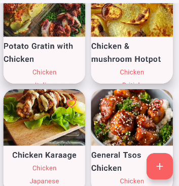
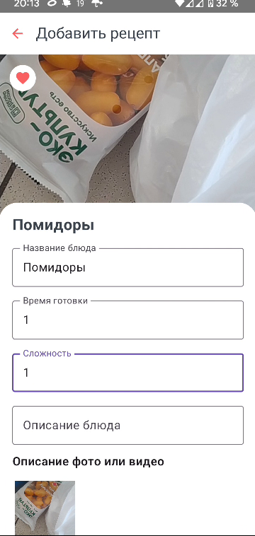
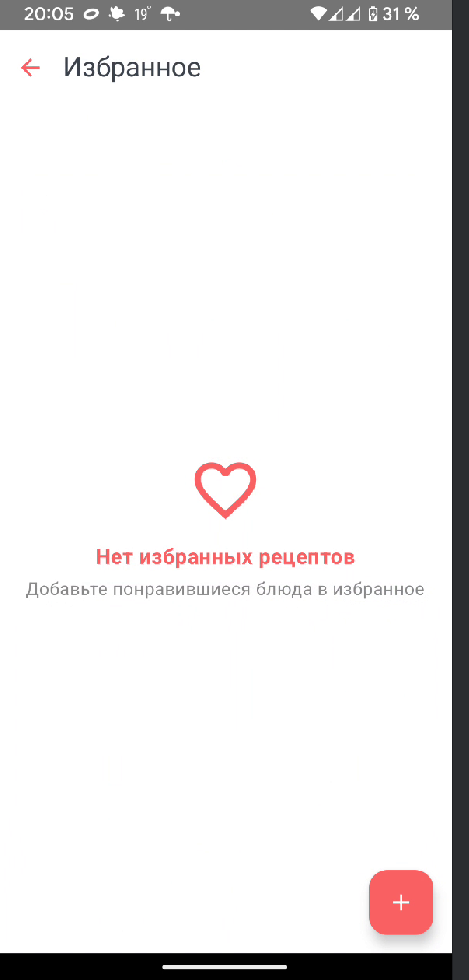
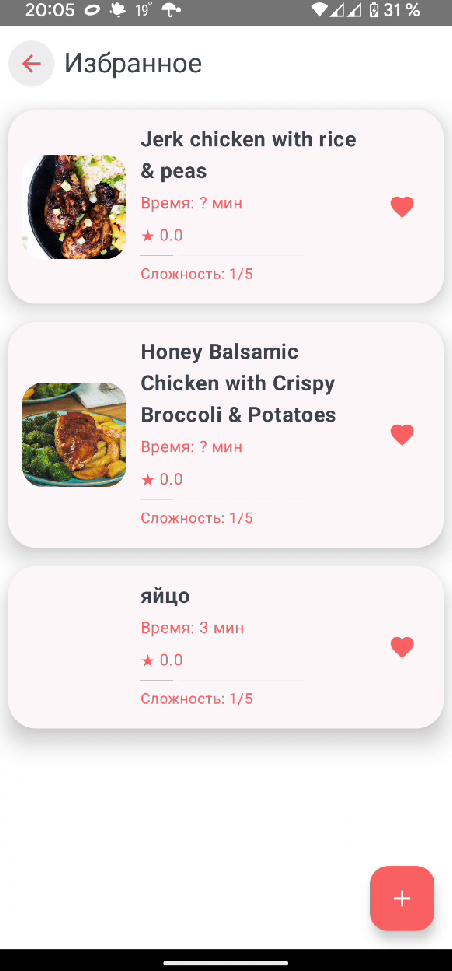
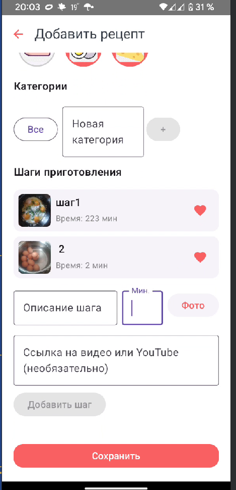
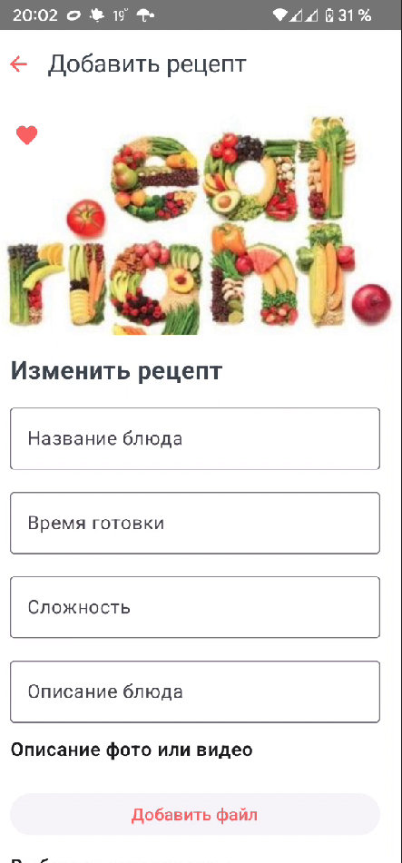
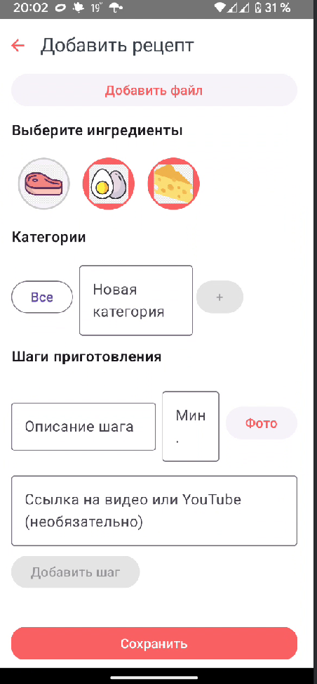
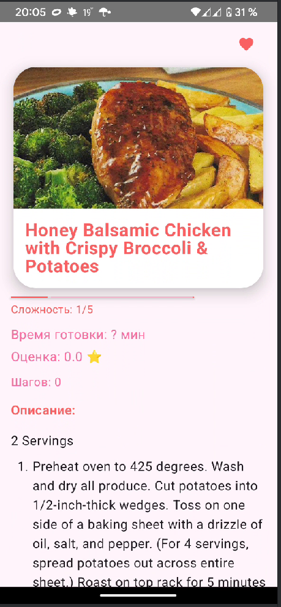

Вот исправленный вариант Markdown-документа с корректными вставками изображений (``) вместо `![[...]]`, чтобы корректно отображались в большинстве Markdown-ридеров и на GitHub:

---

# 🍲 **TastyFood**


**Мобильное Android-приложение с рецептами, категориями, поддержкой пользовательских рецептов и красивым минималистичным UI на Jetpack Compose + Material 3 Expressive**

---

## 📱 Описание

TastyFood — это современное Android-приложение, ориентированное на кулинарных энтузиастов.
Пользователи могут открывать новые рецепты, сортировать их по популярности и сложности, сохранять в избранное, а также делиться собственными блюдами. Интерфейс интуитивен, стилистика вдохновлена Material 3.

---

## 🌟 Ключевые функции:



* **Splash Screen** с анимацией (Lottie)



* **Главная страница**:

  * Цитата с темой готовки
  * Поиск рецептов
  * Категории с возможностью добавлять свои при создании рецептов
  * Сортировка рецептов по популярности, сложности, новизне
  * Лента карточек рецептов: изображение, название, рейтинг, время, сложность




**Карточки рецептов**:

* Включают локальные рецепты, созданные пользователем, и загрузку через API (TheMealDb)
* Фото, ингредиенты (иконки), описание
* Переключение между вкладками: «Описание» / «Рецепт»
* Кнопка «Приступить»




* **Экран рецепта** с мультимедийным содержанием (текст, фото, видео, Markdown)




* **Избранное** — все добавленные в избранное блюда


* **Мои рецепты** — личные рецепты пользователя





* **Добавить рецепт**:

  * Фото, заголовок, сложность, ингредиенты (из базы), Markdown-описание


**Настройки**:

* Темная/светлая тема, размер шрифта, заглушки профиля

---

## 🛠 Используемые технологии

| Технология             | Описание                                                  |
| ---------------------- | --------------------------------------------------------- |
| **Jetpack Compose**    | Основной UI-фреймворк от Google для android приложений    |
| **Material Design 3**  | Современный визуальный стиль                              |
| **Navigation Compose** | Безопасная навигация                                      |
| **Coil**               | Загрузка и кеширование изображений                        |
| **Lottie**             | Анимации для splash и переходов                           |
| **Markdown UI**        | Поддержка форматированного текста при добавлении рецептов |

---

## 🧱 Архитектура

**MVVM + Clean Architecture + Single-Activity App**


```plaintext
📦 Presentation Layer
├── Jetpack Compose UI
├── Navigation
├── ViewModel (Для состояний и событий)

📦 Domain Layer
├── Use Cases
├── Entities
└── Interfaces

📦 Data Layer
├── Room Database для локального хранения (избранное, рецепты, ингредиенты)
├── Supabase
├── Репозитории
```

---

## 💾 База данных

* **Room** — основное хранилище рецептов, ингредиентов, пользовательских рецептов
* **Supabase** — облачное хранилище и аутентификация
* **Local JSON** — для мок-данных категорий и ингредиентов

---

## 📸 Скриншоты

<table>
<tr>
<td align="center"><br/><b>Splash</b></td>
<td align="center"><br/><b>Главный экран</b></td>
<td align="center"><br/><b>Описание рецепта</b></td>
</tr>
<tr>
<td align="center"><br/><b>Мои рецепты</b></td>
<td align="center"><br/><b>Избранное</b></td>
<td align="center"><br/><b>Добавить рецепт</b></td>
</tr>
</table>

---

## ✅ Roadmap

| Фича                                            | Статус         |
| ----------------------------------------------- | -------------- |
| Splash Screen                                   | ✅ Завершено    |
| Главный экран (цитата, поиск, категории, лента) | 🕛 В процессе  |
| Экран рецепта с медиа                           | ✅ Завершено    |
| Добавление рецепта                              | ✅ Завершено    |
| Избранное / Мои рецепты                         | ✅ Завершено    |
| Настройки (тема, размер, заглушки профиля)      | 🕛 В процессе  |
| Supabase Auth + Sync                            | 📤 Планируется |
| Документация                                    | ✅ Readme.md    |

---

## 🔮 Будущие планы

* 📤 **Интеграция синхронизации рецептов и хранение в Supabase**
* 📤 **Интеграция реферальных ссылок для покупки ингредиентов онлайн**
* 📤 **Решение с хранением видео-рецептов (сейчас отображает видео по ссылке YouTube)**
* 📤 **Поддержка мультиплатформенности (KMP для iOS/Web)**
* 📤 **Шеринг рецептов в соцсети и Telegram**

---

## 👨‍🍳 Авторы

**Имя Фамилия** – Android Developer, UI/UX Designer
GitHub: [@yourusername](https://github.com/yourusername)
Telegram: [@yourusername](https://t.me/yourusername)
Email: [your.email@example.com](mailto:your.email@example.com)

---

## 📄 Лицензия

```txt
MIT License

Copyright (c) 2025 Cook Like a Chef

Permission is hereby granted, free of charge, to any person obtaining a copy of this software...
```

📱 Разработано для 👨‍🍳, для 🍲 рецептов

---

Если хочешь, могу сразу подготовить `roadmap.md` и `changelog.md` — просто скажи.
